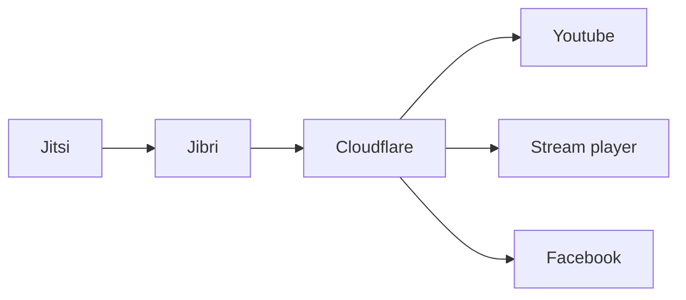

# Jitsi LiveStreaming 

Livestreaming is streaming media simultaneously recorded and broadcast in real-time over the Internet.

# Architecure


* ***Jitsi*** --> Live conferencing application 
* ***Jibri*** --> Record / Stream Jitsi video conference 
* ***Cloudflare*** --> RTMP server 
* ***Youtube***--> We can stream into youtube 
* ***Facebook*** --> We can stream into Facebook 
* ***Stream player***--> We can strem into any custom application , By listening to cloudflare RTMP server,

## FLOW of video Streams 

1.  When ever the livestreaming is enabled for a conference, Livestreaming button would be Enabled through which a moderator/Owner can start the live stream. when ever a livestream button is clicked , In backend we will get the available streams and Start streaming the Jitsi conference. 

Sample Payload for enabling and disabling Live streaming 

```json
{
  "aud": "appid",
  "iss": "appid",
  "sub": "jitsi.yourdomain.com",
  "exp": 1611264624,
  "room": "*",
  "context": {
    "user": {
      "name": "teacher-name",
      "email": "teacher-name@yourdomain.com",
      "affiliation": "teacher"
    },
    "features": {
      "recording": true,
      "livestreaming": true,
      "screen-sharing": true
    }
  }
}
```
2.  Once the stream is started , An api will be called to the player with the required details like stream api key and client id 
3. Using the above Credentials , React/Angular player will start the streaming using HLS 

## Custom Stream player 

Custom Stream player should be designed in React / Angular , Cloudflare provides direct Libraries in order to do this . 

Documentations :

 1. [React](https://www.npmjs.com/package/@cloudflare/stream-angular)
 2. [Angular](https://www.npmjs.com/package/@cloudflare/stream-angular)

# Live viewer counts for players

The Stream player has full support for live viewer counts by default. To get the viewer count for live videos for use with third party players, make a  `GET`  request to the  `/views`  endpoint.
```
https://videodelivery.net/55b9b5ce48c3968c6b514c458959d6a/views
```
Below is a response for a live video with several active viewers:
```
{"liveViewers": 113}
```
###  Available Metrics that can be utilized 

-   Number of views (number of times the video playback has been started)
-   Time viewed in seconds
-   Number of video buffering events
-   Number of times quality level has changed

##  Development APIs 

To start a live stream programmatically, make a  `POST`  request to the  `/live_inputs`  endpoint:
```
curl -X POST \ -H "Authorization: Bearer $TOKEN" \https://api.cloudflare.com/client/v4/accounts/$ACCOUNT/stream/live_inputs --data '{"meta": {"name":"test stream 1"},"recording": { "mode": "automatic", "timeoutSeconds": 10, "requireSignedURLs": false, "allowedOrigins": ["*.example.com"] }}'
```

-   When the mode property is set to  `automatic`, it means the live stream will be automatically available for viewing using HLS/DASH. In addition, the live stream will be automatically recorded for later replays.
-   The  `timeoutSeconds`  property specifies how long a live feed can be disconnected before it results in a new video being created.
-   The  `requireSignedURLs`  property indicates if signed URLs are required to view the video. This setting is applied by default to all videos recorded from the input. In addition, if viewing a video via the live input ID, this field takes effect over any video-level settings.
-   The  `allowedOrigins`  property can optionally be invoked to provide a list of allowed origins. This setting is applied by default to all videos recorded from the input. In addition, if viewing a video via the live input ID, this field takes effect over any video-level settings.

A successful response will return information about the live input.

```
{
  "uid": "f256e6ea9341d51eea64c9454659e576",
  "rtmps": {
    "url": "rtmps://live.cloudflare.com:443/live/",
    "streamKey": "MTQ0MTcjM3MjI1NDE3ODIyNTI1MjYyMjE4NTI2ODI1NDcxMzUyMzcf256e6ea9351d51eea64c9454659e576"
  },
  "created": "2021-09-23T05:05:53.451415Z",
  "modified": "2021-09-23T05:05:53.451415Z",
  "meta": {
    "name": "My Live Stream"
  },
  "status": null,
  "recording": {
    "mode": "automatic",
    "requireSignedURLs": false,
    "allowedOrigins": ["*.example.com"]
  }
}
```
## View by video id

One live input can have multiple video ids associated with it. In order to get the video id representing the current live stream for a given input, make a  `GET`  request to the  `/stream`  endpoint:

```json
GET https://api.cloudflare.com/client/v4/accounts/{account}/stream/live_inputs/{live-input-uid}/videos
```
The response will contain the HLS/DASH URL that can be used to play the current live video as well as any previously recorded live videos:

```json
{
  "result": [
    {
      "uid": "55b9b5ce48c3968c6b514c458959d6a",
      "thumbnail": "https://videodelivery.net/55b9b5ce48c3968c6b514c458959d6a/thumbnails/thumbnail.jpg",
      "thumbnailTimestampPct": 0,
      "readyToStream": false,
      "status": {
        "state": "live-inprogress",
        "errorReasonCode": "",
        "errorReasonText": ""
      },
      "meta": {
        "name": "Stream Live Test 23 Sep 21 05:44 UTC"
      },
      "created": "2021-09-23T05:44:30.453838Z",
      "modified": "2021-09-23T05:44:30.453838Z",
      "size": 0,
      "preview": "https://watch.videodelivery.net/55b9b5ce48c3968c6b514c458959d6a",
      "allowedOrigins": [],
      "requireSignedURLs": false,
      "uploaded": "2021-09-23T05:44:30.453812Z",
      "uploadExpiry": null,
      "maxSizeBytes": null,
      "maxDurationSeconds": null,
      "duration": -1,
      "input": {
        "width": -1,
        "height": -1
      },
      "playback": {
        "hls": "https://videodelivery.net/55b9b5ce48c3968c6b514c458959d6a/manifest/video.m3u8",
        "dash": "https://videodelivery.net/55b9b5ce48c3968c6b514c458959d6a/manifest/video.mpd"
      },
      "watermark": null,
      "liveInput": "34036a0695ab5237ce757ac53fd158a2"
    },
    {
      "uid": "2ba59740c897a197df70814fd5ad991",
      "thumbnail": "https://videodelivery.net/2ba59740c897a197df70814fd5ad991/thumbnails/thumbnail.jpg",
      "thumbnailTimestampPct": 0,
      "readyToStream": true,
      "status": {
        "state": "ready",
        "pctComplete": "100.000000",
        "errorReasonCode": "",
        "errorReasonText": ""
      },
      "meta": {
        "name": "CFTV Staging 22 Sep 21 22:12 UTC"
      },
      "created": "2021-09-22T22:12:53.587306Z",
      "modified": "2021-09-23T00:14:05.591333Z",
      "size": 0,
      "preview": "https://watch.videodelivery.net/2ba59740c897a197df70814fd5ad991",
      "allowedOrigins": [],
      "requireSignedURLs": false,
      "uploaded": "2021-09-22T22:12:53.587288Z",
      "uploadExpiry": null,
      "maxSizeBytes": null,
      "maxDurationSeconds": null,
      "duration": 7272,
      "input": {
        "width": 640,
        "height": 360
      },
      "playback": {
        "hls": "https://videodelivery.net/2ba59740c897a197df70814fd5ad991/manifest/video.m3u8",
        "dash": "https://videodelivery.net/2ba59740c897a197df70814fd5ad991/manifest/video.mpd"
      },
      "watermark": null,
      "liveInput": "34036a0695ab5237ce757ac53fd158a2"
    }
  ],
  "success": true,
  "errors": [],
  "messages": []
}
```

## View by live input uid

By using the live input uid in place of a video id in the hls/dash manifest URL, you get a static URL that will return a 200 with the manifest of the active livestream, or a 204 status code with no content if there is no active live stream.

Using the input ID in this manner is fully integrated in the Stream player, but may require some additional support for third party players. You can make a  `GET`  request to the  `/lifecycle`  endpoint to get additional data about a video id or live input uid for more information to make additional decisions.

```
GET https://videodelivery.net/34036a0695ab5237ce757ac53fd158a2/lifecycle
```

This is a response for an input ID with an active live stream:

```json
{
      // indicates if the ID provided is for an input or a video
    "isInput": true,
    // returns the active video ID or null for an input ID, otherwise returns the provided video ID
    "videoUID": "55b9b5ce48c3968c6b514c458959d6a",
    // if isInput is true, indicates if the input is actively streaming or not
    "live": true
}
```

Or if the input ID does not have an active live stream:

``` json
{
    "isInput": true,
    "videoUID": null,
    "live": false
}
```

## Replaying recordings

Live streams are automatically recorded. To get a list of recorded streams for a given input id, make the same  `GET`  request as you would to get the live video and filter for videos where the state property is set to  `ready`:

``` json
GET https://dash.cloudflare.com/api/v4/accounts/{account}/stream/live_inputs/{live-input-id}/videos
```

This is what a response looks like:
```json
{
  "result": [
...
    {
      "uid": "2ba59740c897a197df70814fd5ad991",
      "thumbnail": "https://videodelivery.net/2ba59740c897a197df70814fd5ad991/thumbnails/thumbnail.jpg",
      "thumbnailTimestampPct": 0,
      "readyToStream": true,
      "status": {
        "state": "ready",
        "pctComplete": "100.000000",
        "errorReasonCode": "",
        "errorReasonText": ""
      },
      "meta": {
        "name": "Stream Live Test 22 Sep 21 22:12 UTC"
      },
      "created": "2021-09-22T22:12:53.587306Z",
      "modified": "2021-09-23T00:14:05.591333Z",
      "size": 0,
      "preview": "https://watch.videodelivery.net/2ba59740c897a197df70814fd5ad991",
      "allowedOrigins": [],
      "requireSignedURLs": false,
      "uploaded": "2021-09-22T22:12:53.587288Z",
      "uploadExpiry": null,
      "maxSizeBytes": null,
      "maxDurationSeconds": null,
      "duration": 7272,
      "input": {
        "width": 640,
        "height": 360
      },
      "playback": {
        "hls": "https://videodelivery.net/2ba59740c897a197df70814fd5ad991/manifest/video.m3u8",
        "dash": "https://videodelivery.net/2ba59740c897a197df70814fd5ad991/manifest/video.mpd"
      },
      "watermark": null,
      "liveInput": "34036a0695ab5237ce757ac53fd158a2"
    }
  ],
  "success": true,
  "errors": [],
  "messages": []
}
```

